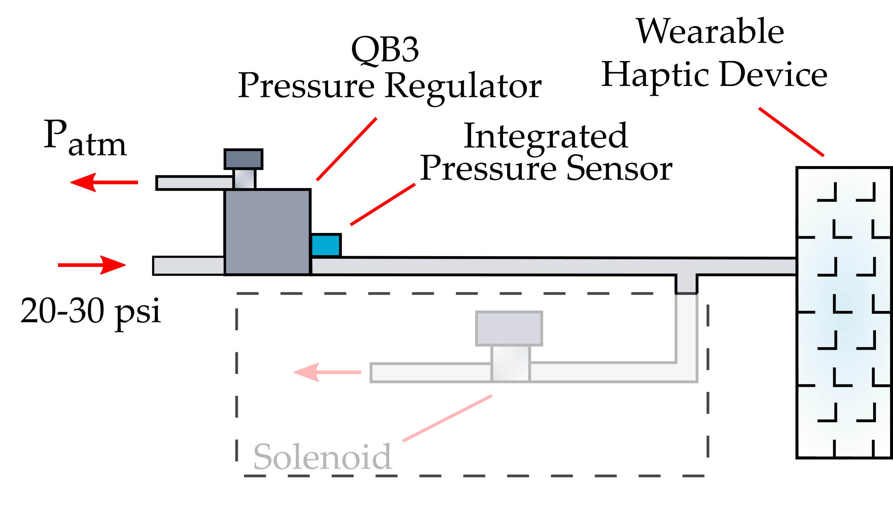

# Wearable Haptic Wristband

The band was composed of a row of thin-walled inflatable plastic pouches: increasing the pneumatic pressure caused the pouches to inflate and apply normal forces to the participant’s wrist. We used this haptic wristband to notify the human when the robot approached a waypoint that it was confused about. Normally the band was kept uninflated (0 psi), but when the robot moved close to a waypoint where it was uncertain, the band inflated (3 psi) to squeeze the human’s wrist and alert them about the robot’s confusion.

The wearable haptic device is made out of a thin, heat-sealable low-density polyethylene (LDPE) plastic tube. (1" wide). The heat-sealed pattern was made using a linear heat sealer. This design was developed by the authors based on our prior work. More details on the fabrication of these inflatable haptic devices can be found here: https://ieeexplore.ieee.org/abstract/document/10029880. 

## Implementation
The basic pneumatic control systems used to actuate the wearable haptic wristband consisted of: 
- A pressure regulator that supplied an electronically controlled pressurized-air supply
- A pressure release feature for deflating the displays. 

The pressure regulator used in our implementation has a built in sensor and exhaust (QB3, Proportion-Air, McCordsville, Indiana) and was controlled using a DAC and an Arduino Uno using the **pneumatic_control.ino** script. 

