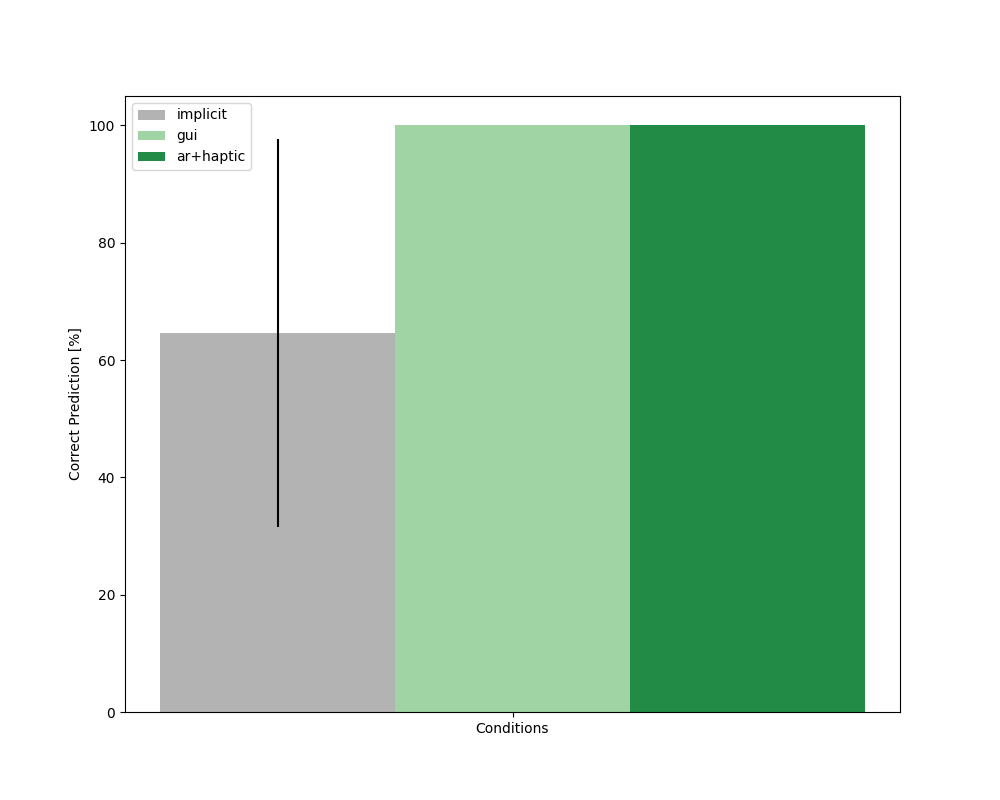

# User Study Results
We used two objective metrics to analyze the outcomes of closing the loop on robot learning.

1. `Correct Prediction`: records how frequently users were able to correctly predict which chair leg the robot was assembling.

2. `Error`: the robot's error in assembling the chair legs after receiving corrections from the human.


### Plot Objective Resutls
To plot `Correct Prediction` run this command in terminal:
```
python plot_prediction.py
```
To plot `Error` run this command in terminal:
```
python plot_error.py
```
The plots will be saved in this directory (`/plots`).

<div style="display: flex; justify-content: space-between;">


